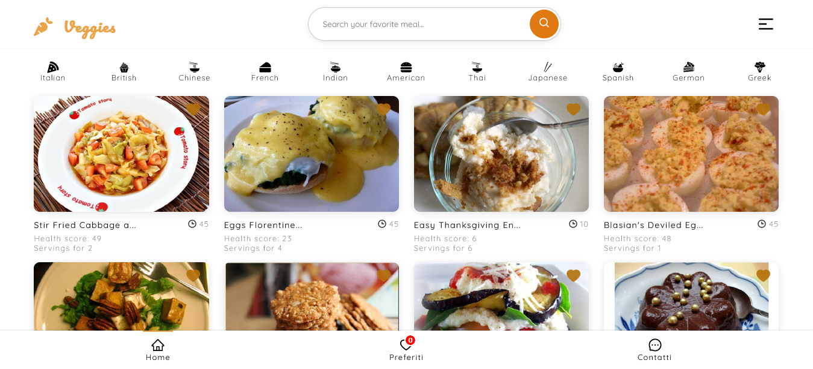
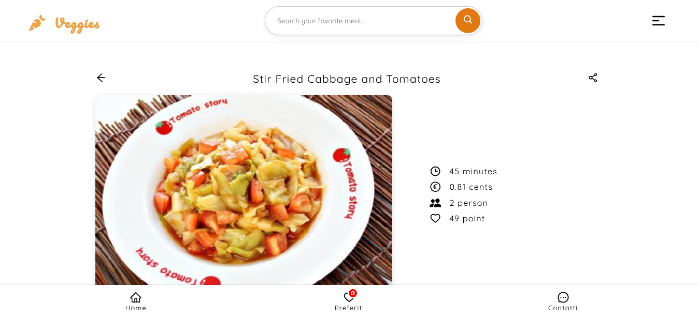
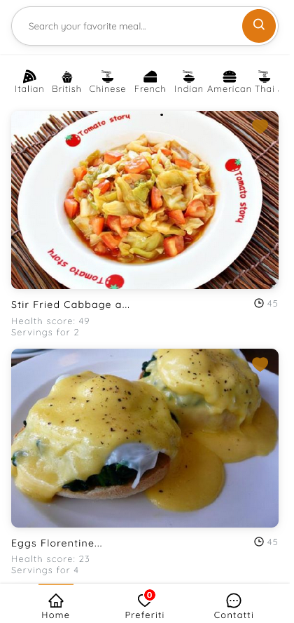

### Veggies, vegetarian recipes</br>
A simple app for show you a collection of vegetarian recipes.
## Table of Contents
[General info](#general-info)</br>
[Technologies](#technologies)</br>
[Setup](#setup)</br>


### General info
This app fetch the data from Spoonacular free api, and then display it in home page, categories pages and trough the search form.
* A home page to display the recipes.
* A search form for your recipes.
* A save bottom to save the more interesting recipes.
* A favorite bottom to show the recipes that you saved.





### Technologies

- [React](https://it.reactjs.org/)
- [Javascript](https://developer.mozilla.org/en-US/docs/Web/JavaScript?retiredLocale=it)
- [Webpack 5](https://webpack.js.org/blog/2020-10-10-webpack-5-release/)
- [Axios](https://github.com/axios/axios)
- [Styled Components](https://styled-components.com/)
- [React Icons](https://react-icons.github.io/react-icons/)
- [React Router](https://reactrouter.com/en/main)
- [React Skeleton](https://skeletonreact.com/)


### Setup

Download [Node](https://nodejs.org/en/) and installed it on your operating system like windows or mac.


1. Clone the repository on local server:

   ```sh
   git clone https://github.com/francescoup/s2i-react-app-veggie
   ```

2. Install NPM packages:

   ```sh
   npm install
   ```

3. Build from source:

   ```sh
   npm run build
   ```

4. Run the live server:

	```sh
   npm run start
   ```


## License

Distributed under the MIT License.

## Links

You can see the app at the following link:

Live Site: [Recipes app](https://s2i-react-test.netlify.app)</br>
Spoonacular API : [Spoonacular](https://spoonacular.com/)


